## 💡 About Me

Hi! Here is Tenire. I've mainly worked with more mainstream languages such as C/C++, TypeScript and Lua.

When I'm free, I enjoy [📖 reading](), watching [🎬 movies]() and [📺 anime](), and listening to [🎧 music](). I also work on useful/useless side projects from time to time.

If you're interested, please checkout my personal [✏️ blog](https://tenire.com) where I share my ordinary yet joyful life. 

Feel free to contact me via <a href="mailto:i@tenire.com">Email</a> or [Telegram](https://t.me/tenotinrule).

## 📊 Stats

|  |  |
| :----------------------------------------------------------: | ------------------------------------------------------------ |
|                                                              |                                                              |

